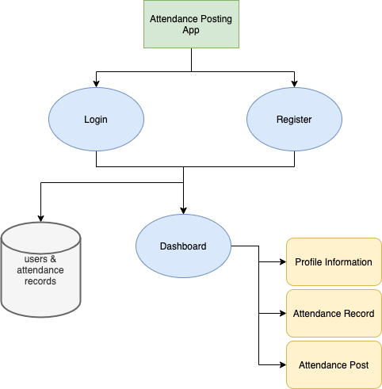

# A Basic Attendance Management Application

Experimenting with tkinter Python GUI library to create a basic login/post attendance app using SQL

**Techstack**: mySQL, Python

## Dependancies

1. tkinter
2. mysql.connector
3. mysql database

## Flowchart

